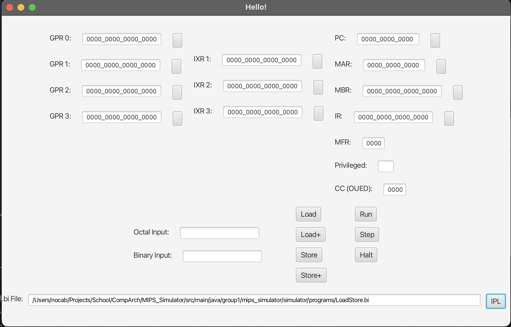

# Example Usage

### Start the Simulator

#### Mac

Launch the program by navigating to the root level of this project in a terminal:

```bash
cd <path/to/this/directory>
```

Then, run the Simulator jar with the following command (NOTE: It may take up to 10 seconds to launch):

```bash
java --module-path out/artifacts/MIPS_Simulator_jar/ \
     --add-modules javafx.controls,javafx.fxml,javafx.graphics \
     -jar out/artifacts/MIPS_Simulator_jar/MIPS_Simulator.jar
```

#### Windows: 

When testing on Windows 11 we ran into some issues with compatability between Java FX and the default Orical JDK installed.

Please download these items directly from their respetive hosts.
- OpenJDK: https://jdk.java.net/21/
  - Diret Download Link: https://download.java.net/java/GA/jdk21.0.2/f2283984656d49d69e91c558476027ac/13/GPL/openjdk-21.0.2_windows-x64_bin.zip
- JavaFX lib: https://gluonhq.com/products/javafx/
  - Direct Download Link: https://download2.gluonhq.com/openjfx/21.0.2/openjfx-21.0.2_windows-x64_bin-sdk.zip

Extract/ unzip the above downloaded folders and place them into the root level of this project.

- javafx-sdk-21.0.2.zip
- jdk-21.0.2.zip

Use the OpenJDK v21 with the access to the JavaFX SDK modules with this command:
```bash
jdk-21.0.2/bin/java  --module-path javafx-sdk-21.0.2/lib --add-modules javafx.controls,javafx.base,javafx.fxml,javafx.graphics,javafx.media,javafx.web --add-opens=javafx.graphics/javafx.scene=ALL-UNNAMED --add-exports javafx.base/com.sun.javafx.event=ALL-UNNAMED -jar out/artifacts/MIPS_Simulator_jar/MIPS_Simulator.jar
```

NOTE: The Fonts used in the Windows are different than the font used in Mac, so some of the Register Display windows are a little too small.


### Load the .bi file

Click on the IPL button in the bottom right. This will open a file selector dialogue window.
Select the example file found in the location: `src/main/java/group1/mips_simulator/simulator/programs/LoadStore.bi`



### Confirm the file loaded properly

Press the `Load+` button and look and the MAR and MBR registers. 
After the first press it should be
```
MAR: 0000_0000_0001
MBR: 0000_0000_0000_0000
```