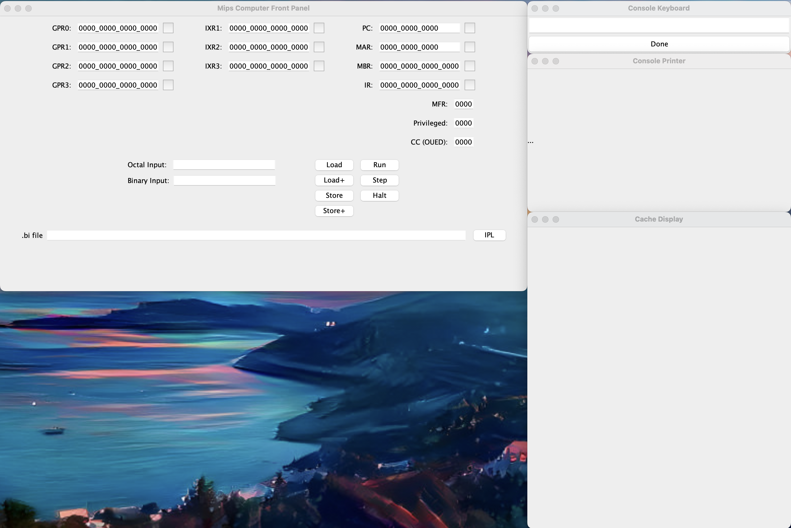

# MIPS Simulator

This project is part 2 of a MIPS Simulator.

## Running the Simulator

To run the simulator:

1. Unzip our project directory in a folder of your choice
2. Navigate into that directory from terminal. There are two ways to do this: 
- Using Windows Explorer: 
  - navigate into unzipped directory folder 
  - launch the Command Prompt from the address bar
- Using terminal/cd: 
  - navigate into the unzipped directory via `cd` commands
  - The path will look something like: 
  ```bash
  "<path/to/documents>/Team 1 Machine Simulator Part II CSCI6461Section12Spring2024March32024/"
  - ```  
3. Run the jar command in terminal/cmd:

```bash
java -jar MIPS_Simulator.jar
```

NOTE: This command may take up to ~10 seconds for the application window to launch.
Please be patient.


The Simulator opens as separate, draggable windows:



---
# Project Part 2 

## How to Load a Program
  1. Select the IPL Button on the Front Panel
  2. Navigate to this project's directory
  3. Choose the `.bi` file to load 
  4. Select the front panel's `Octal Input`
  5. enter the octal key provided in [instructions](INSTRUCTIONS.md) (This is where our programs starts)
  6. Click Run, then follow the on-screen instructions 

  For further details and instructions for specific programs, please see: 
  <br>[Instructions.md](INSTRUCTIONS.md)

## UI
### Console Keyboard
Simulates a console keyboard that allows users to enter values per program requests.

### Console Printer
Simulates a display which will output a program's prompts and values as a program runs. 

### Cache Display
Provides a view into the simulator's cache, displaying each cache line's tags and block

### *Important Note:* 
Our keyboard will malfunction when entering unexpected inputs.
- Please make sure a program that requests inputs is running **before** entering a value via Keyboard.
- Make sure your input **matches the type requested** by prompt (i.e. numbers are integers, words are strings, etc.).
- Our program works best when following the order of events outlined on the [instructions](INSTRUCTIONS.md) page.
  + Clicking `Done` before running a program will input a previously entered value without waiting for a user input
  + Clicking `Done` without typing anything will enter a null value, which will not be visible to the user
    <br> <i>Deviation from instruction order will likely result in unexpected events and outputs.</i>


## otes regarding the UI

---
# Project Part 1

## Input Fields

The `Octal Input` and `Binary Input` fields only accept number.
As their names suggest, `Octal Input` only accepts octal number, while `Binary Input` only accepts binary values.
Updating one field will automatically convert and update the other.

If an invalid character is put into either field, then it will be highlighted red.

Once a valid number has been inserted into the `Input` fields, clicking any of the buttons next to the various registers
will load that register with the value from the Inputs.

## Load, Load+, Store, Store+

These action buttons give the user functionality for directly accessing the contents of Memory.

### Load

The `Load` button looks up the contents of memory at the address specified by MAR, and puts it into MBR

```
MBR <- c(MAR)
```

### Load+

The `Load+` button is similar to the `Load` button, but will increase the MAR value after the load operation.

```
MBR <- c(MAR)
MAR <- MAR+1
```

### Store

The `Store` button takes the contents of the MBR, and puts it into memory at the address specified by the MAR

```
c(MAR) <- MBR
```

### Store+

The `STORE+` button is similar to the `Store` button, but it will increase the value of the MAR before executing the
store.

```
MAR <- MAR+1
c(MAR) <- MBR
```

## Run Step Halt

The Run Step and Halt buttons instruct the machine to process instructions at the current `PC` value.

### Run

This will tell the machine simulator to read the instruction from memory (specified by the PC), execute it, and repeat
forever. Execution will only stop for one of 2 reasons:

- The User presses the `Halt` button
- The program signals a stop, either from a `hlt` instruction or some other error

### Step

Similar to the `Run` button, this will read the instruction (found in memory at the PC address) and execute it. However,
the `Step` button only runs a single command, and will not repeatedly execute more instructions.

### Halt

A button that allows the user to directly halt the program. Only functional when the program has
been `Run`.

## .bi File Input

The user may specify a `.bi` (or a `.txt`) file that contains machine code. This file will be loaded into memory via the
RomLoader.
