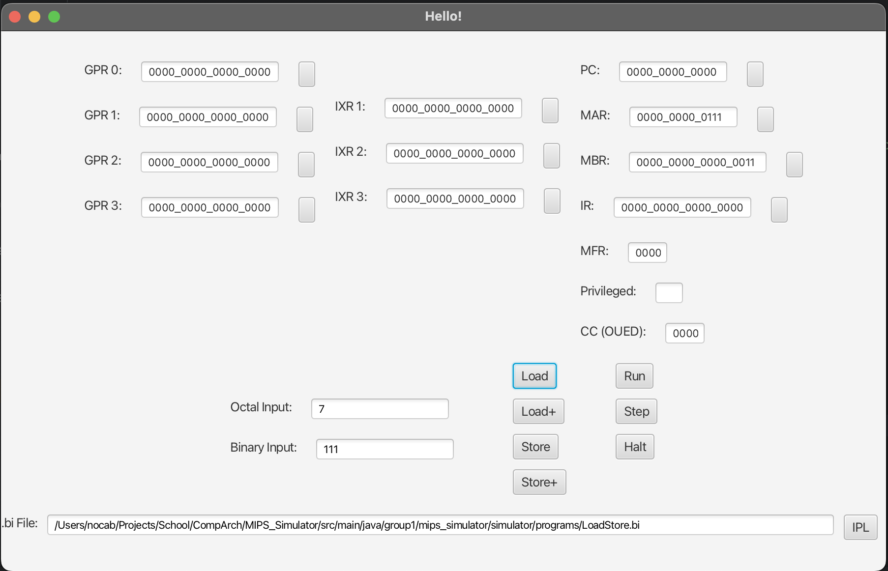
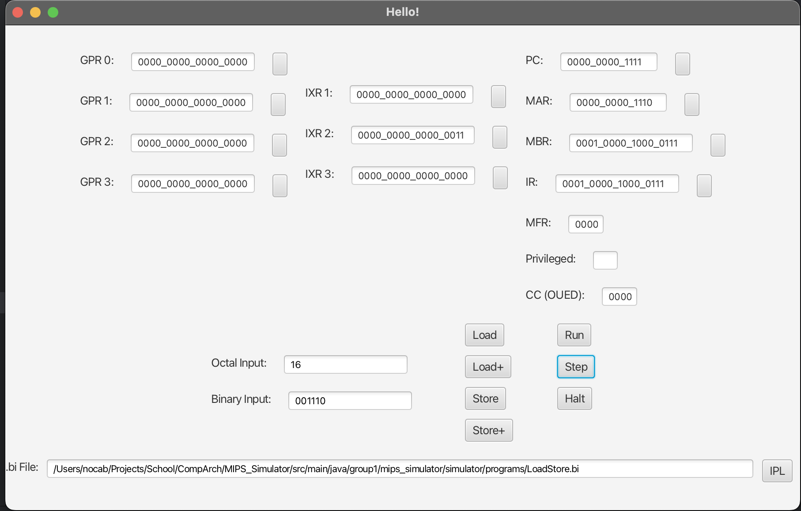
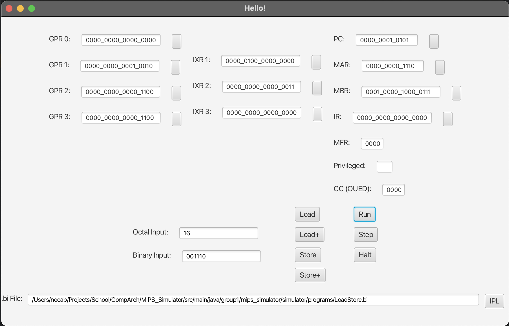

# Example Usage

### Start the Simulator

Launch the program by navigating to the root level of this project in a terminal:

```bash
cd <path/to/this/directory>
```

Then, run the Simulator jar with the following command (NOTE: It may take up to 10 seconds to launch):

```bash
java --module-path out/artifacts/MIPS_Simulator_jar/ \
     --add-modules javafx.controls,javafx.fxml,javafx.graphics \
     -jar out/artifacts/MIPS_Simulator_jar/MIPS_Simulator.jar
```


### Load the .bi file

Click on the IPL button in the bottom right. This will open a file selector dialogue window.
Select the example file found in the location: `src/main/java/group1/mips_simulator/simulator/programs/LoadStore.bi`


### Confirm the file loaded properly

Press the `Load+` button and look and the MAR and MBR registers.
After the first press it should be:

```
MAR: 0000_0000_0001
MBR: 0000_0000_0000_0000
```

In the `Octal Input` field, type `7` (or the value `111` in binary). Press the button next to the `MAR` Memory Address
Register. Then press `Load`:

```
Octal Input: 7
Press MAR button
Press Load
```

Then notice the value in `MBR` memory buffer register should be: the value `0000_0000_0000_0011`


### Run the first instruction

Enter the number 16 in the Octal Input (memory address of the first instruction).
Press the button next to MAR, then press Load.

```
Octal Input: 16
Press MAR button
Press Load
```

The MAR and MBR should show the following data:

```
MAR: 0000_0000_1110
MBR: 0001_0000_1000_0111
```


The MBR (memory buffer register) shows the first real instruction of the `LoadStore.bi` file!

Load the value 16 into the PC (program counter), then press Step

```
Press PC button
Press Step
```

Notice the IR (Instruction Register) gets loaded with the same value that's currently in the MBR.
Notice the IXR1 gets new data! Therefore, the first instruction "X2 GETS 3" has executed properly

Notice all the things that have changed:

```
IR = c(PC) = 0001_0000_1000_0111
IX2 = 0000_0000_0000_0011
PC = PC + 1 = 0000_0000_1111
```



## Run all the instructions

Now click the `Run` button. This will execute all the remaining instructions in the `LoadStore.bi` ROM (from the current
PC of 0000_0000_1111). This machine has `hlt` instructions implemented so the program will automatically halt.

```
Presss Run Button
```

Here is the final screen:


