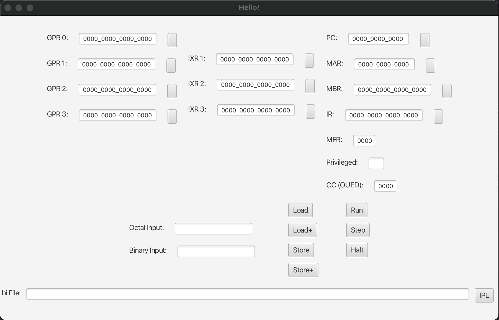

# MIPS Simulator

This project is part 1 of a MIPS Simulator.

## Running the Simulator

To run the simulator:
1. Open terminal/cmd
2. Navigate to `~/MIPS_Simulator` root directory
3. Run the following command in terminal/cmd:
```bash
java --module-path out/artifacts/MIPS_Simulator_jar/ \
     --add-modules javafx.controls,javafx.fxml,javafx.graphics \
     -jar out/artifacts/MIPS_Simulator_jar/MIPS_Simulator.jar
```

NOTE: This command may take up to ~10 seconds for the application window to launch.<br>
Please be patient. If it still won't run, see the Troubleshooting section for more information.



## Input Fields

The `Octal Input` and `Binary Input` fields only accept number.
As their names suggest, `Octal Input` only accepts octal number, while `Binary Input` only accepts binary values.
Updating one field will automatically convert and update the other.

If an invalid character is put into either field, then it will be highlighted red.

Once a valid number has been inserted into the `Input` fields, clicking any of the buttons next to the various registers
will load that register with the value from the Inputs.

## Load, Load+, Store, Store+

These action buttons give the user functionality for directly accessing the contents of Memory.

### Load

The `Load` button looks up the contents of memory at the address specified by MAR, and puts it into MBR

```
MBR <- c(MAR)
```

### Load+

The `Load+` button is similar to the `Load` button, but will increase the MAR value after the load operation.

```
MBR <- c(MAR)
MAR <- MAR+1
```

### Store

The `Store` button takes the contents of the MBR, and puts it into memory at the address specified by the MAR

```
c(MAR) <- MBR
```

### Store+

The `STORE+` button is similar to the `Store` button, but it will increase the value of the MAR before executing the
store.

```
MAR <- MAR+1
c(MAR) <- MBR
```

## Run Step Halt

The Run Step and Halt buttons instruct the machine to process instructions at the current `PC` value.

### Run

This will tell the machine simulator to read the instruction from memory (specified by the PC), execute it, and repeat
forever. Execution will only stop for one of 2 reasons:

- The User presses the `Halt` button
- The program signals a stop, either from a `hlt` instruction or some other error

### Step

Similar to the `Run` button, this will read the instruction (found in memory at the PC address) and execute it. However,
the `Step` button only runs a single command, and will not repeatedly execute more instructions.

### Halt

A button that allows the user to directly halt the program. Only functional when the program has
been `Run`.

## .bi File Input

The user may specify a `.bi` (or a `.txt`) file that contains machine code. This file will be loaded into memory via the
RomLoader.


## Troubleshooting
If the simulator does not start from running the command listed earlier:
```bash
java --module-path out/artifacts/MIPS_Simulator_jar/ \
     --add-modules javafx.controls,javafx.fxml,javafx.graphics \
     -jar out/artifacts/MIPS_Simulator_jar/MIPS_Simulator.jar
```
Consider the following:
- Running the command from this file in an IDE like IntelliJ may attempt to run the command in the <br>
`~/MIPS_Simulator/_Submission/Documents` directory. This will not work. <br>
Make sure to navigate to `your/save/location/MIPS_Simulator/` directory in a terminal window, <br>
and run the command there.
- The bash command is based on the following:
  - `--module-path` build location of all `.jar` artifacts of our project
  - `--add-modules` javaFX modules for UI elements <br>(must be installed prior to running)
  - `-jar` jar file location for `MIPS_Simulator.jar`
